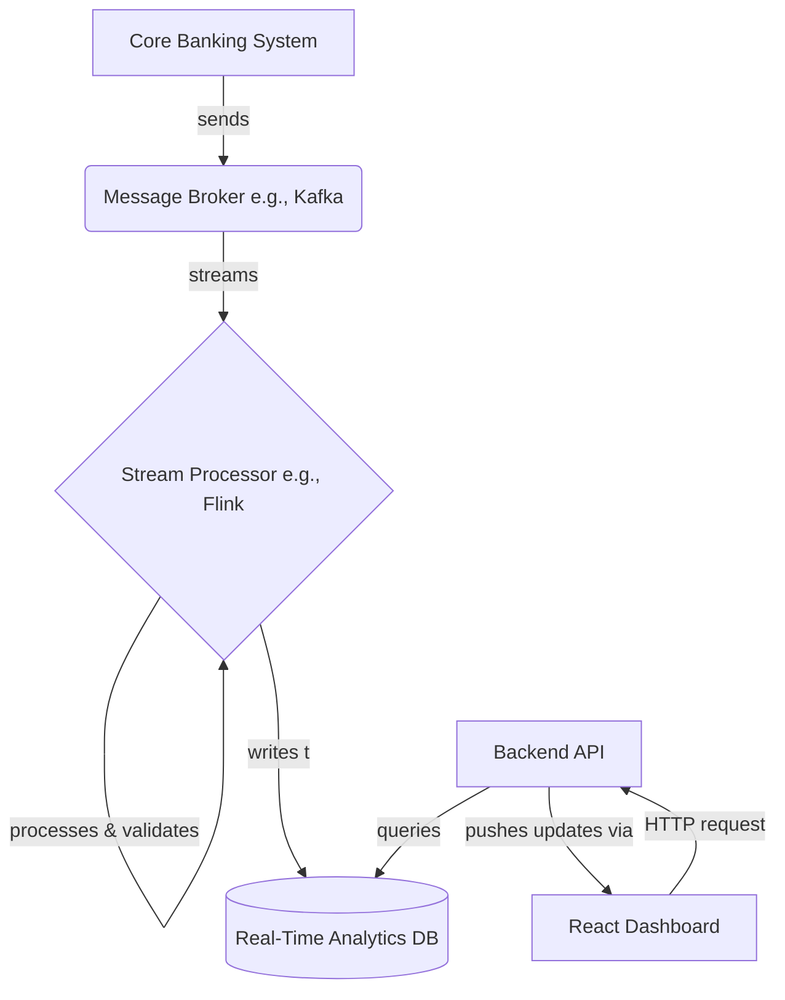

# System_Design

## Executive Summary

My current implementation is a batch-processing system, which is the correct and efficient model for a static CSV file. However, upgrading to a "real-time" dashboard requires a fundamental architectural shift. The static approach poses challenges in latency and scalability that I would address by moving to a modern, event-driven streaming architecture.

### 1. Architectural Challenges of My Current Approach
For real-time updates, my current static file-based system presents three main challenges:

- **Latency:** To update the dashboard, the entire multi-million row file would need to be re-processed from scratch. This introduces significant data lag, making "real-time" impossible.

- **State Management:** My analytics functions are currently stateless, they recalculate everything on each run. A real-time system must be stateful, capable of incrementally updating metrics (like a branch's total volume) as each new transaction arrives.

- **Scalability:** The current model of processing a single, monolithic file does not scale for a continuous, high-volume data feed. A real-time system requires decoupled services that can handle the data stream independently.

### 2. Proposed High-Level System Design
To solve these challenges, I propose a scalable, event-driven architecture. The core principle is to process each transaction as a single event in a continuous stream, rather than as a row in a large batch file.

#### Data Flow Explanation:

- **Ingestion:** Instead of a CSV, live transactions from the core banking system are published as events to a message broker like Apache Kafka.

- **Processing:** A Stream Processor (using a framework like Apache Flink) subscribes to this stream. It would run my existing validation and anomaly detection logic on each individual transaction event as it arrives.

- **Storage:** The validated transaction is then written to a Real-Time Analytics Database (like Apache Druid), which is optimized for the fast queries needed to power a live dashboard.

- **Serving:** A Backend API queries this database to get the aggregated data for the frontend.

- **Visualization:** The React Dashboard fetches initial data via a standard HTTP request and then uses WebSockets to receive live pushed updates from the backend, allowing the charts to update automatically.

## 3. How My Existing Functions Would Be Modified
Transitioning to this streaming model would require refactoring my existing logic:

- **Data Input:** My functions like `detectAnomalousTransactions` and `calculateCustomerLTV` would no longer accept an array `(CleanedTransaction[])`. They would be re-engineered to process a single transaction event at a time.

- **Stateful Logic:** The aggregation logic would become stateful. For example, instead of recalculating a branch's total volume from scratch, a function would receive a new transaction and the branch's current total, and simply return the updated total. This is far more efficient.

- **Interface Evolution:** While the `CleanedTransaction` interface would remain, it would now represent a single event in a stream. New API interfaces would be introduced to define the contracts for querying the aggregated data (e.g., `GET /api/dashboard/branch-performance`).