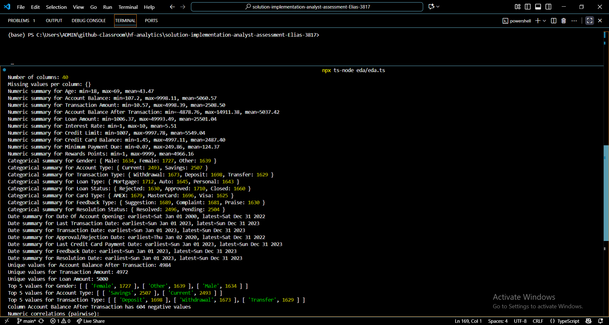

# Exploratory Data Analysis (EDA)
This EDA dives into the Comprehensive Banking Database to understand both the structure and quality of the data before any analysis or visualization.
Across 5,000 customer records and 40 columns, there are no missing values, which is excellent, but some numeric anomalies like negative account balances were identified and flagged for review.
Numeric columns show expected ranges and largely independent distributions, while categorical variables reveal balanced splits across genders, account types, and transaction types. Dates are consistent, spanning realistic banking timelines.

The code is modular and reusable, separating numeric, categorical, and date summaries, making it easy to extend for validation, cleaning, or aggregation. This foundation ensures that the subsequent steps in the challenge can be built on a clean, trustworthy, and scalable dataset.

## 1. File: eda.ts
Purpose: Modular EDA for structured insights on the banking dataset.
Key Features:
- **Modular Functions**: Separate utilities for CSV loading, parsing, and column-wise summaries.
- **Numeric, Categorical, and Date Summaries**: Each column type is analyzed with min, max, mean, counts, and ranges.
- **Missing Values & Anomalies**: Detects null/empty values and flags anomalies such as negative balances.
- **Correlations**: Computes pairwise correlations for numeric variables to detect basic relationships.
- **Scalable & Maintainable**: Designed so each function can be reused independently or extended for future analysis.

## 2. Columns Overview
- **Total rows**: 5000
- **Total columns**: 40
- **Missing values**: 0

#### Columns include:
- Customer Info: `Customer ID`, `First Name`, `Last Name`, `Age`, `Gender`, `Address`, `City`, `Email`, `Contact Number`
- Account Info: `Account Type`, `Account Balance`, `Date Of Account Opening`
- Transaction Info: `TransactionID`, `Transaction Date`, `Transaction Type`, `Transaction Amount`, `Account Balance After Transaction`, `Branch ID`
- Loan Info: `Loan ID`, `Loan Amount`, `Loan Type`, `Interest Rate`, `Loan Term`, `Approval/Rejection Date`, `Loan Status`
- Card Info: `CardID`, `Card Type`, `Credit Limit`, `Credit Card Balance`, `Minimum Payment Due`, `Last Credit Card Payment Date`, `Rewards Points`
- Feedback Info: `Feedback ID`, `Feedback Date`, `Feedback Type`, `Resolution Status`, `Resolution Date`
- Anomaly flag: `Anomaly`

## 3. Numeric Summaries

| Column                            | Min      | Max      | Mean     |
| --------------------------------- | -------- | -------- | -------- |
| Age                               | 18       | 69       | 43.47    |
| Account Balance                   | 107.2    | 9998.11  | 5060.57  |
| Transaction Amount                | 10.57    | 4998.39  | 2508.50  |
| Account Balance After Transaction | -4878.76 | 14911.38 | 5037.42  |
| Loan Amount                       | 1006.37  | 49993.49 | 25501.04 |
| Interest Rate                     | 1        | 10       | 5.51     |
| Credit Limit                      | 1007     | 9997.78  | 5549.04  |
| Credit Card Balance               | 1.45     | 4997.11  | 2487.40  |
| Minimum Payment Due               | 0.07     | 249.86   | 124.37   |
| Rewards Points                    | 1        | 9999     | 4966.16  |

**Notes:**

* Account Balance After Transaction has 604 negative values, which may indicate overdrafts or errors.

## 4. Categorical Summaries

| Column            | Unique Values | Top Values                                         |
| ----------------- | ------------- | -------------------------------------------------- |
| Gender            | 3             | Female (1727), Other (1639), Male (1634)           |
| Account Type      | 2             | Savings (2507), Current (2493)                     |
| Transaction Type  | 3             | Deposit (1698), Withdrawal (1673), Transfer (1629) |
| Loan Type         | 3             | Mortgage (1712), Auto (1645), Personal (1643)      |
| Loan Status       | 3             | Approved (1710), Closed (1660), Rejected (1630)    |
| Card Type         | 3             | MasterCard (1696), AMEX (1679), Visa (1625)        |
| Feedback Type     | 3             | Suggestion (1689), Complaint (1681), Praise (1630) |
| Resolution Status | 2             | Pending (2504), Resolved (2496)                    |

## 5. Date Summaries

| Column                        | Earliest   | Latest     |
| ----------------------------- | ---------- | ---------- |
| Date Of Account Opening       | 2000-01-01 | 2022-12-31 |
| Last Transaction Date         | 2023-01-01 | 2023-12-31 |
| Transaction Date              | 2023-01-01 | 2023-12-31 |
| Approval/Rejection Date       | 2020-01-02 | 2022-12-31 |
| Last Credit Card Payment Date | 2023-01-01 | 2023-12-31 |
| Feedback Date                 | 2023-01-01 | 2023-12-31 |
| Resolution Date               | 2023-01-01 | 2023-12-31 |

## 6. Additional Insights 
### Note:
*These contribute very little to our analysis but are worth sharing incase anyone needed to see them.*

- Unique counts:
    - **Account Balance After Transaction**: 4984
    - **Transaction Amount**: 4972
    - **Loan Amount**: 5000
- Pairwise correlations (numeric):
    - **Age vs Account Balance**: 0.02
    - **Age vs Transaction Amount**: 0.02
    - **Account Balance vs Transaction Amount**: 0.03

**Interpretation**: Weak correlations suggest numeric variables are largely independent at this stage.

*A snapshot of the output from the code* ⬇

